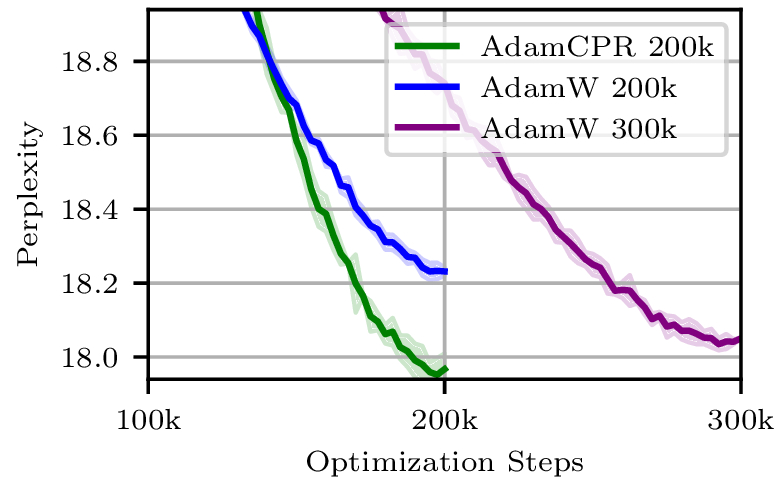
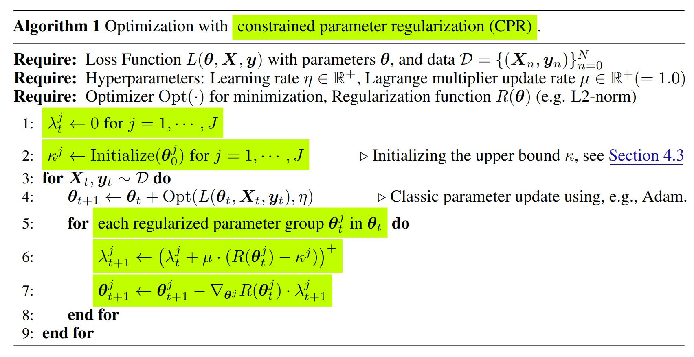

# Improving Deep Learning Optimization through Constrained Parameter Regularization

This repository contains the PyTorch implementation of [**Constrained Parameter Regularization**](https://arxiv.org/abs/2311.09058)(CPR) with the Adam optimizer.
CPR is an alternative to traditional weight decay. Unlike the uniform application of a single penalty, CPR enforces an upper bound on a statistical measure, such as the L2-norm, of individual parameter matrices. CPR introduces only a minor runtime overhead and only requires setting an upper bound (or does it automatically with an inflection point detection). 

AdamCPR outperforms AdamW on various tasks, such as image classification (CIFAR100 and ImageNet) or language modeling finetuning or pretraining (GPT2/OpenWebText) as in the figure below.



We see the perplexity of GPT2s model training on OpenWebText with AdamW for 200k steps (blue) and 300k steps (purple) vs. AdamCPR with inflection point detection (green). The CPR model converges more linear and achieves a lower validation perplexity, equivalent to training 50% longer with AdamW.
Please find more experiments in our [paper](https://arxiv.org/abs/2311.09058). 

## How does it work?

With CPR, learning becomes a constraint optimization problem, which we tackle using an adaptation of the augmented Lagrangian method.
We implement this by adding a Lagrange multiplier $\lambda$ (scalar) and an upper bound $\kappa$ (scalar) for each parameter matrix $W$ in the model and update them each optimization step. We introduce four techniques for initializing the upper bound: `'uniform'` with a fixed value ,`'depended'` on the initial parameter norm, `'warm_start'` based on the norm after X training steps and a `'inflection_point'` detection-based method which doesn't require any additional hyperparameter for the regularization.
We implement this Lagrange optimization directly in the Adam optimizer, which we call AdamCPR:




## Install

```bash
pip install pytorch-cpr
```

## Getting started

We implemented CPR with Adam optimizer in PyTorch (v2.3.1+). To use CPR, you can simply replace the optimizer in your training script with the AdamCPR optimizer.

### Example usage

```python
from pytorch_cpr import AdamCPR

# for AdamCPR with warm start initialization
optimizer = AdamCPR(model, lr=0.001, kappa_init_param=1000, kappa_init_method='warm_start')
# for AdamCPR with inflection point initialization (no other regularization hyperparameter needed)
optimizer = AdamCPR(model, lr=0.001, kappa_init_method='inflection_point')
```

### Arguments of AdamCPR

#### Basic Optimizer Parameters
| Parameter | Type | Default | Description |
|-----------|------|---------|-------------|
| `params` | iterable | required | Iterable of parameters to optimize or dicts defining parameter groups |
| `lr` | float | 1e-3 | Learning rate. Note: Tensor lr is only supported with `capturable=True` |
| `betas` | tuple(float, float) | (0.9, 0.999) | Coefficients for computing running averages of gradient and its square |
| `eps` | float | 1e-8 | Term added to denominator for numerical stability |
| `amsgrad` | bool | False | Whether to use the AMSGrad variant from ["On the Convergence of Adam and Beyond"](https://openreview.net/forum?id=ryQu7f-RZ) |

#### CPR-Specific Parameters
| Parameter | Type | Default | Description                                                                                                                                                                                                                                                                                                                                                                          |
|-----------|------|---------|--------------------------------------------------------------------------------------------------------------------------------------------------------------------------------------------------------------------------------------------------------------------------------------------------------------------------------------------------------------------------------------|
| `kappa_init_method` | str | 'inflection_point' | Method to initialize regularization bound. Options:<br>• `'uniform'`: Fixed value initialization<br>• `'warm_start'`: Delayed initialization<br>• `'dependent'`: Parameter-dependent initialization<br>• `'inflection_point'`: Automated inflection point detection-based initialization.                                                                                            |
| `kappa_init_param` | float | 1000.0 | Initial value for the regularization bound, the meaning depends on the initialization method: <br>• `'uniform'`: The value of the upper bound.<br>• `'warm_start'`: The number of steps before setting the upper bount to the current regularization value.  <br>• `'dependent'`: The factor of the reg. value after initialization.<br>• `'inflection_point'`: No param. requiered. |
| `reg_function` | str | 'l2' | Regularization function type. Options:<br>• `'l2'`: L2 norm regularization<br>• `'l1'`: L1 norm regularization<br>• `'std'`: Standard deviation regularization<br>• `'huber'`: Huber norm regularization                                                                                                                                                                             |


## Run examples

We provide scripts to replicate the experiments from our paper. Please use a system with at least 1 GPU. Install the package and the requirements for the example:

```bash
python3 -m venv venv
source venv/bin/activate
pip install -r examples/requirements.txt
pip install pytorch-cpr
``` 


### Modular Addition / Grokking Experiment

The grokking experiment should run within a few minutes. The results will be saved in the `grokking` folder.
To replicate the results in the paper, run variations with the following arguments:

####  For AdamW:
```bash
python examples/train_grokking_task.py --optimizer adamw --weight_decay 0.1
```

####  For Adam + Rescaling:
```bash
python examples/train_grokking_task.py --optimizer adamw --weight_decay 0.0 --rescale 0.8
```

####  For AdamCPR with L2 norm as regularization function:
```bash
python examples/train_grokking_task.py --optimizer adamcpr --kappa_init_method dependent --kappa_init_param 0.8
```


### Image Classification Experiment

The CIFAR-100 experiment should run within 20-30 minutes. The results will be saved in the `cifar100` folder.


####  For AdamCPR with L2 norm as regularization function and kappa initialization depending on the parameter initialization:
```bash
python examples/train_cifar100_task.py --optimizer adamcpr --lr 0.001 --kappa_init_method dependent --kappa_init_param 1.0
```

####  For AdamCPR with L2 norm as regularization function and kappa initialization with warm start:
```bash
python examples/train_cifar100_task.py --optimizer adamcpr --lr 0.001 --kappa_init_method warm_start --kappa_init_param 1000
```

####  For AdamAdaCPR with L2 norm as regularization function and kappa initialization with inflection point:
```bash
python examples/train_cifar100_task.py --optimizer adamcpr --lr 0.001 --kappa_init_method inflection_point 
```

####  For AdamW:
```bash
python examples/train_cifar100_task.py --optimizer adamw --lr 0.001 --weight_decay 0.001
```

####  For Adam + Rescaling:
```bash
python examples/train_cifar100_task.py --optimizer adamw --lr 0.001 --weight_decay 0 --rescale_alpha 0.8
```

####  For Adam + AWD:
```bash
python examples/train_cifar100_task.py --optimizer adam_awd --lr 0.001 --weight_decay 0.1 
```

####  For Adam + AdaDecay:
```bash
python examples/train_cifar100_task.py --optimizer adam_adadecay --lr 0.001 --weight_decay 0.1 
```

## Citation

Please cite our paper if you use CPR in your work:
    
```
@misc{franke2024cpr,
      title={Improving Deep Learning Optimization through Constrained Parameter Regularization}, 
      author={Jörg K. H. Franke and Michael Hefenbrock and Gregor Koehler and Frank Hutter},
      journal={Advances in Neural Information Processing Systems},
      volume={37},
      year={2024},
}
```

